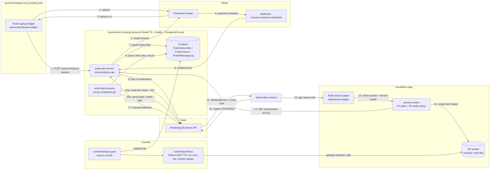

# Architecture

## System overview

## Why this shape

**Backend reuses Quantinnel, doesn't parallel it.** `services/pulse-api` is a new *service* deployed through Quantinnel's existing Node/TS + Fastify + Postgres/Prisma pipeline (Docker → K8s → GitHub Actions, per the Group 1 implementation playbook already in this project), not a new stack. The only new infrastructure is what Quantinnel genuinely doesn't have yet: WhatsApp delivery (Twilio) and the audio/edge layer.

**WhatsApp needs Twilio because Quantinnel doesn't do messaging today.** Confirmed with Sundeep: Quantinnel's Postgres/Prisma layer holds subscriber + lesson state, but the WhatsApp Business API integration is net-new, same as it was scoped in the separate "Quantum in 10" plan already in this project (which validated this exact Stripe → Twilio → daily-cron pattern).

**Two delivery formats, sent and tracked independently.** Each day, a subscriber gets a WhatsApp *text* (hook + link) and a WhatsApp *audio* message (the narrated lesson, sent as WhatsApp media). These are logged as separate `PulseMessageLog` rows so an audio-send failure (e.g. Twilio media size limits, transient error) never blocks the text hook, and vice versa — see `services/pulse-api/src/jobs/send-daily-lessons.ts`.

**Audio is synthesized once, locally, not per request.** `content/synthesis` runs Kokoro-82M + ffmpeg locally to produce one `.m4b` per lesson day, uploaded once to Cloudflare R2. This is a deliberate reuse of the local-TTS-then-edge-storage pattern from the audio-distribution reference doc: R2 has no egress fee, so serving the same 21 files to any number of subscribers costs the same as serving them to one, and there's no synthesis-on-demand server to run or pay for.

**Lesson pages stay static and backend-light.** Tapping a lesson link loads a static HTML page from Cloudflare Pages — no server render per subscriber. The page calls the access-worker client-side to check the phone number (from the link's query string) is allowed to see that day, then streams the matching audio file if so. This mirrors the "Quantum in 10" decision to keep lesson viewing as the simplest, least-breakable part of the system.

**The access-worker is a thin, cacheable gate — not the source of truth.** `PulseSubscriber.currentDay` in Postgres (via `services/pulse-api`) is what decides whether a subscriber has "reached" a given day. The Cloudflare Worker calls `GET /pulse/verify-access` and caches the answer in KV for 5 minutes so repeated audio byte-range requests don't hammer the origin API, but it never makes the access decision itself. This avoids the two-systems-disagree failure mode of duplicating subscriber state at the edge.

## Idempotency and edge cases (carried over from the validated "Quantum in 10" design)

- Stripe webhooks can be delivered more than once — `stripe-webhook.ts` upserts on `stripeCheckoutSessionId`, never blindly inserts.
- The send job runs **hourly**, not once daily, and checks each subscriber's *local* time band — a fixed UTC send time would land at 3am for some subscribers.
- DST transitions are handled via IANA timezone math (`Intl.DateTimeFormat`), not a fixed UTC offset per subscriber.
- "STOP" is handled in application code (`whatsapp-inbound.ts`) — WhatsApp doesn't auto-enforce it the way US SMS carriers do.
- A send failure (text or audio) leaves `currentDay` unchanged so it's retried on the next hourly tick, rather than silently skipping a day.

## Open decisions to confirm with the Quantinnel platform team before deploying

1. Does `services/pulse-api` deploy into Quantinnel's existing Postgres instance (separate `quantum_pulse` schema) or get its own managed Postgres? The Prisma schema here assumes a dedicated schema to avoid any table-name collisions.
2. What's the actual deploy target (cluster name, registry, Helm chart or raw K8s manifests)? `.github/workflows/deploy-api.yml` is a placeholder until this is confirmed.
3. Where does the hourly `send-daily-lessons` job run — a K8s CronJob alongside Quantinnel's other scheduled work, or a separate GitHub Actions scheduled workflow? Avoid standing up a second scheduling system if Quantinnel already has one.
4. Twilio WhatsApp Business + Meta verification is the long-pole external dependency (1-3 week approval) — start this immediately, in parallel with everything else, same as flagged in the "Quantum in 10" intern task breakdown.
